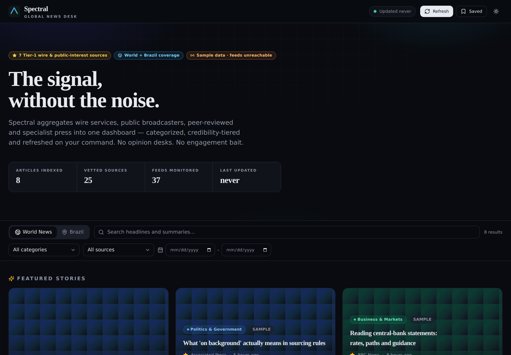
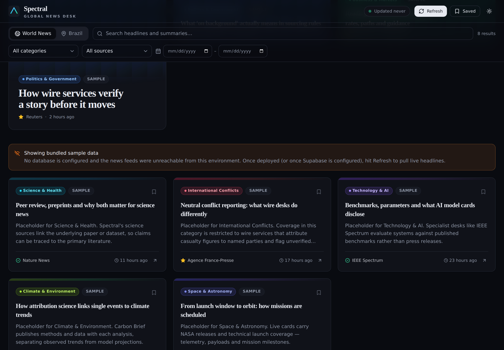
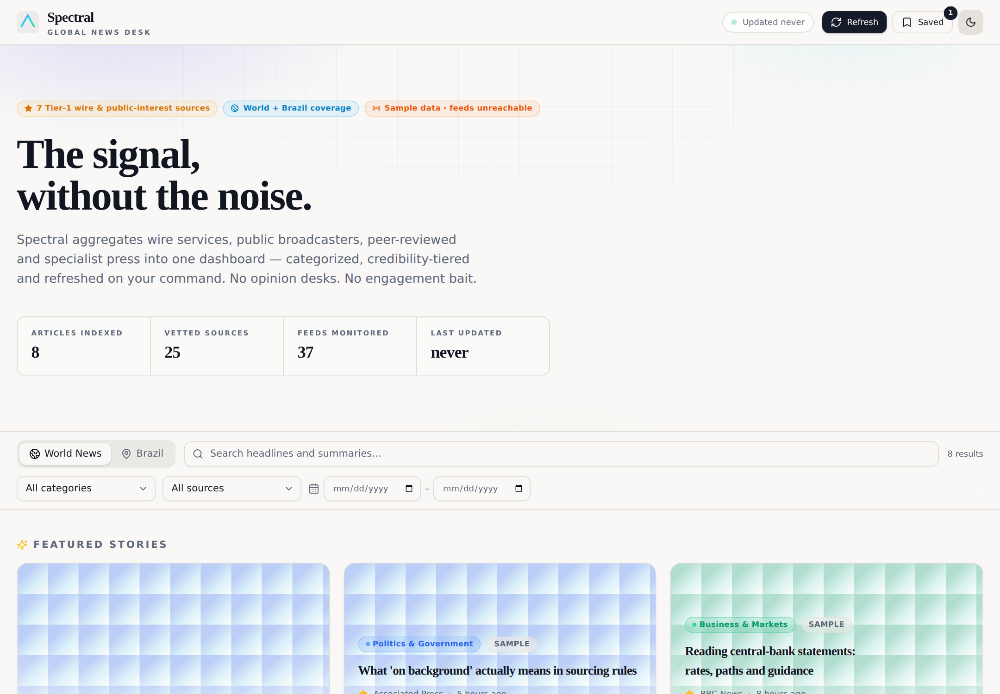

# Spectral — Global News Dashboard

**The signal, without the noise.** A fact-first news aggregator that pulls wire
services, public broadcasters, peer-reviewed and specialist press into one
dark-mode editorial dashboard — categorized, credibility-tiered, searchable,
and refreshed on your command. Includes a dedicated Brazil section sourced from
independent Brazilian newsrooms.



| Masonry grid | Light theme |
|---|---|
|  |  |

## Features

- **25 vetted sources, 37 feeds** — Reuters, AP, AFP, BBC, NPR, ProPublica,
  The Conversation, plus specialist desks (IEEE Spectrum, Nature, NASA, Carbon
  Brief…) and independent Brazilian press (Agência Pública, Nexo, Núcleo,
  Aos Fatos, Canaltech, Tecnoblog). Full rationale in [docs/SOURCES.md](docs/SOURCES.md).
- **Credibility tiers** — ★ gold star for Tier-1 wire/public-interest sources,
  ✓ for Tier-2 specialist press, with explainer tooltips on every card.
- **7 world categories + 6 Brazil categories**, color-coded, assigned by a
  transparent keyword classifier (EN + PT).
- **Manual refresh** — one button fetches all feeds in parallel server-side,
  dedupes, stores, and reports per-source results. No background sync.
- **Advanced search & filters** — keyword, source, category, date range, and
  World/Brazil tabs, all combinable.
- **Saved articles** — bookmark to a slide-over panel; persisted in
  localStorage and synced to Supabase when configured.
- **Featured stories** — freshest Tier-1 pieces promoted to a hero trio.
- **Editorial design** — default dark theme (light available), Fraunces/Inter
  type pairing, masonry grid, staggered card animations, skeleton loading,
  "last updated" ticker. Fully responsive.
- **No news API keys required** — everything arrives via public RSS/Atom
  (Reuters/AP/AFP through the keyless Google News RSS proxy).

## Architecture

```
┌────────────────────────── Vercel ──────────────────────────┐
│                                                            │
│  Vite + React + TS + Tailwind + shadcn/ui   (static dist/) │
│        │  /api/* (rewrite)                                 │
│        ▼                                                   │
│  api/index.ts — Express app as a serverless function       │
│   ├─ GET  /api/articles    query + filters + pagination    │
│   ├─ POST /api/refresh     fetch 37 feeds → classify →     │
│   │                        dedupe → upsert → prune         │
│   ├─ GET  /api/health      mode, counts, last update       │
│   ├─ GET  /api/sources     registry + categories           │
│   └─ CRUD /api/favorites   optional device-keyed sync      │
│        │                                                   │
└────────┼───────────────────────────────────────────────────┘
         ▼
   Supabase Postgres — articles · sources · categories · user_favorites
   (optional: without it the API runs in "live" fetch-on-demand mode)
```

- `shared/` is the single source of truth (types, source registry, categories,
  classifier) imported by both the React app and the API.
- **Three data modes**, automatic: `supabase` (persistent), `live` (no DB —
  warm-instance cache), `sample` (no DB **and** no network — bundled,
  clearly-labeled placeholders so the UI never renders empty).

## Quick start (local)

```bash
npm install
npm run dev        # API on :8787 + Vite on :5173 (proxied)
```

Open http://localhost:5173. Without Supabase configured the app runs in
**live mode** — Refresh fetches feeds directly and serves them from memory.

## Supabase setup (recommended)

1. Create a free project at [supabase.com](https://supabase.com).
2. Open **SQL Editor**, paste the contents of
   [`supabase/schema.sql`](supabase/schema.sql), and run it. This creates
   `articles`, `sources`, `categories`, `user_favorites`, indexes, RLS
   policies, the `prune_articles()` retention function, and seeds categories.
3. Copy credentials from **Project Settings → API**:
   - Project URL → `SUPABASE_URL`
   - `service_role` secret → `SUPABASE_SERVICE_ROLE_KEY`
4. Locally: `cp .env.example .env` and fill both values. Restart `npm run dev`.
5. Click **Refresh** in the app — articles now persist (default retention:
   newest 1,200, always ≥ 500).

> The service-role key is used **only** inside serverless functions and is
> never shipped to the browser. `user_favorites` has no public RLS policies —
> it is reachable only through the API.

## Deploy to Vercel

1. Push this repository to GitHub.
2. [vercel.com/new](https://vercel.com/new) → import the repo. Vercel
   auto-detects Vite; `vercel.json` already wires `/api/*` to the Express
   function with a 60s budget for refreshes.
3. Add environment variables (Project → Settings → Environment Variables):
   `SUPABASE_URL`, `SUPABASE_SERVICE_ROLE_KEY` (and optionally the tuning vars
   from [.env.example](.env.example)).
4. Deploy. Open the site, hit **Refresh**, and verify with
   `https://<your-app>.vercel.app/api/health`.

### Optional: scheduled refresh

The product behavior is user-triggered refresh only. If you ever want a
warm database anyway, set `REFRESH_TOKEN`, then add to `vercel.json`:

```json
"crons": [{ "path": "/api/refresh?token=YOUR_TOKEN", "schedule": "0 */6 * * *" }]
```

## Environment variables

| Variable | Required | Default | Purpose |
|---|---|---|---|
| `SUPABASE_URL` | for persistence | — | Supabase project URL |
| `SUPABASE_SERVICE_ROLE_KEY` | for persistence | — | Server-side service-role key |
| `REFRESH_TOKEN` | no | unset (open) | If set, `POST /api/refresh` requires it (`Bearer` header or `?token=`) |
| `FEED_TIMEOUT_MS` | no | `9000` | Per-feed fetch timeout |
| `ITEMS_PER_FEED` | no | `14` | Max items ingested per feed per refresh |
| `MAX_ARTICLES_RETAINED` | no | `1200` | Retention ceiling (min 500) |
| `REFRESH_COOLDOWN_SECONDS` | no | `60` | Minimum interval between refreshes |

No news-provider API keys are needed — see
[docs/SOURCES.md](docs/SOURCES.md#why-reutersapafp-arrive-via-google-news).

## API reference

| Endpoint | Description |
|---|---|
| `GET /api/articles` | Query params: `region` (`world`\|`brazil`), `q`, `category`, `source`, `from`/`to` (`yyyy-mm-dd`), `limit` (≤200), `offset`. Returns `{ articles, total, lastUpdated, mode }`. |
| `POST /api/refresh` | Fetches every feed (optionally `?scope=world\|brazil`), classifies, dedupes by content hash, upserts, prunes. Returns counts plus per-feed stats. Respects the cooldown. |
| `GET /api/health` | Mode, source/feed counts, last update, version. |
| `GET /api/sources` | The source registry and category list. |
| `GET/POST/DELETE /api/favorites` | Device-keyed favorites sync (no-ops gracefully without Supabase). |

## Verifying feeds

```bash
npm run check:feeds
```

Fetches all 37 registered feeds and prints ✓/✗ per feed with item counts and
latency. Run it from a network that allows general outbound HTTP (some CI
sandboxes don't — a wall of identical 403s means the network, not the feeds).

## Project structure

```
api/            Express app deployed as one Vercel serverless function
  _lib/         feed fetching, classifier glue, Supabase store, live cache
server/dev.ts   same app on :8787 for local development
shared/         types, source registry, categories, classifier (FE + BE)
src/            React app
  components/   dashboard sections + shadcn/ui primitives (components/ui)
  hooks/        articles, favorites, theme, toasts, clock
  lib/          API client, category visuals, formatting
supabase/       schema.sql (tables, RLS, retention function, seeds)
scripts/        check-feeds.ts
docs/           SOURCES.md (methodology) + screenshots
```

## Troubleshooting

- **"Showing bundled sample data"** — the API couldn't reach any feed and no
  DB is configured. Normal in offline sandboxes; on Vercel, hit Refresh.
- **Refresh returns `skipped: true`** — you're inside the cooldown window.
- **A source stopped producing articles** — its feed URL may have changed.
  `npm run check:feeds`, then update `shared/sources.ts`.
- **Search seems too literal** — live/sample modes use substring match; the
  Supabase path uses indexed `ilike` (an FTS index is already in the schema if
  you want to upgrade the query in `api/_lib/store.ts`).

## License & content

Code: MIT. Headlines, summaries and images remain © their respective
publishers; Spectral stores short excerpts and links every card to the
original article.
